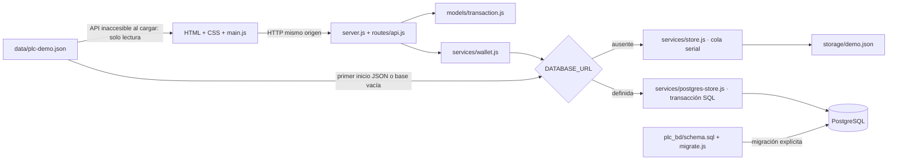

# Proletarian Coin — demo local con JSON o PostgreSQL

PLC conserva el frontend HTML/CSS y añade una API de desarrollo para simular saldo, envíos, recepciones, historial, detalle y recargas. **No es una criptomoneda desplegada, una billetera custodial ni un servicio de pagos.** Todos los PLC son ficticios. No ingreses datos personales, contraseñas, datos bancarios reales, direcciones Ethereum reales ni frases semilla.

## Inicio rápido

Requisito: Node.js 22 o superior con npm. El modo JSON usa solo módulos incluidos en Node.js. PostgreSQL es opcional y usa la dependencia `pg` declarada en `package.json`. No hay proceso de compilación.

```sh
git clone https://github.com/ddepazos/plc.git
cd plc
npm start
```

Abre `http://127.0.0.1:3000` y selecciona **Entrar a la demo**. También puedes abrir `http://127.0.0.1:3000/pages/dashboard.html`. Para el modo JSON no hace falta instalar paquetes. Las fuentes de Google son opcionales; si no hay conexión, el navegador usa fuentes de respaldo. JavaScript no depende de jQuery.

```sh
npm install
npm test
```

La suite incluye pruebas del adaptador PostgreSQL, por eso requiere instalar `pg`; el uso normal del modo JSON sigue funcionando sin esa instalación. Las pruebas crean archivos temporales aislados y no modifican tu demo. Para detener el servidor, presiona Ctrl+C. En modo JSON, ejecuta **un solo proceso por archivo de persistencia**; la cola de escritura es por proceso, no distribuida.

### Configuración

| Variable | Predeterminado | Uso |
| --- | --- | --- |
| `PORT` | `3000` | Puerto HTTP; usa otro si está ocupado. |
| `PLC_DATA_FILE` | `backend/storage/demo.json` | Archivo JSON de desarrollo; las rutas relativas se resuelven desde el directorio de ejecución. |
| `DATABASE_URL` | Sin valor | Si está definida, usa PostgreSQL en vez del archivo JSON. No hay conversión automática de datos entre ambos modos. |\n| `NODE_ENV` | Sin valor | Usa `production` en Render para habilitar configuración de despliegue. |\n| `HOST` | `127.0.0.1` local / `0.0.0.0` producción | Dirección donde escucha Node. |\n| `ALLOWED_ORIGINS` | Vacío | Orígenes frontend permitidos, separados por coma; por ejemplo `https://ddepazos.github.io`. |

En desarrollo el host permanece en `127.0.0.1`. Con `NODE_ENV=production`, el servidor puede escuchar en `0.0.0.0` para Render y limita solicitudes de navegador mediante `ALLOWED_ORIGINS`. No se lee `.env` automáticamente; configura variables en el entorno del proveedor. Usa `.env.example` solo como plantilla y nunca subas credenciales reales.

PowerShell:

```powershell
$env:PORT = '3001'
$env:PLC_DATA_FILE = Join-Path (Get-Location) 'backend/storage/otra-demo.json'
npm start
```

macOS/Linux:

```sh
PORT=3001 PLC_DATA_FILE=backend/storage/otra-demo.json npm start
```

Para empezar otra simulación, detén el servidor y cambia `PLC_DATA_FILE` a una ruta nueva. Para reiniciar la habitual, conserva una copia y renombra `backend/storage/demo.json` con el servidor detenido; el siguiente inicio vuelve a usar el seed. Nunca edites el archivo mientras el servidor está activo.

### PostgreSQL opcional

Necesitas un servidor PostgreSQL de desarrollo y una base vacía a la que tengas permiso de crear tablas. Instala la dependencia y aplica el esquema **antes** de iniciar el servidor:

```sh
npm install
# Configura DATABASE_URL en tu entorno con la URL de tu base local de prueba.
npm run db:migrate
npm start
```

Ejemplo de forma de la variable, con marcadores que debes reemplazar localmente: `postgresql://<usuario>:<clave>@127.0.0.1:5432/<base_demo>`. En PowerShell: `$env:DATABASE_URL = 'postgresql://...'`; en macOS/Linux: `export DATABASE_URL='postgresql://...'`. No guardes la URL, contraseñas ni archivos `.env` en Git ni pegues credenciales en incidencias. El proyecto no carga `.env` automáticamente. Si omites `DATABASE_URL`, vuelve al modo JSON; `PLC_DATA_FILE` solo rige ese modo.

`npm run db:migrate` aplica `plc_bd/schema.sql` mediante `plc_bd/migrate.js`. Al iniciar con una base vacía, `postgres-store.js` inserta la cuenta y los movimientos ficticios desde `data/plc-demo.json`; si la base ya contiene usuarios, no repite el seed. Las lecturas se refrescan desde PostgreSQL y cada operación usa una transacción y bloqueo de billetera para comprobar saldo e idempotencia. El esquema incluye tablas preparatorias de sesiones y ajustes de seguridad, pero **no hay login, sesiones ni 2FA implementados**. Lee [PLC_BD](plc_bd/README.md) y su [diagrama ER](plc_bd/diagrama-er.md).

## Arquitectura



El servidor también puede entregar los archivos públicos. En desarrollo funciona a mismo origen; para el despliegue separado GitHub Pages → Render, el backend habilita CORS únicamente para los orígenes declarados en `ALLOWED_ORIGINS`. `DATABASE_URL` elige PostgreSQL al arrancar; de lo contrario se usa el JSON local. El cliente consulta el estado al entrar en cada pantalla y al volver a enfocar la ventana, y lo refresca después de una operación. No hay WebSocket ni sincronización continua entre pestañas.

### Árbol y función de cada archivo

```text
plc/
├── .gitignore                  # excluye persistencia, secretos, logs y node_modules
├── package.json                # Node >=22; start, test, db:migrate; pg opcional en ejecución
├── README.md                   # contrato y guía de ejecución del proyecto
├── index.html                  # portada, comunidad y FAQ de la demo
├── assets/
│   ├── css/styles.css          # identidad visual original, responsive, foco y estados
│   └── js/main.js              # API, render seguro, formularios, fallback y navegación
├── data/plc-demo.json           # seed ficticio original; no se modifica al operar
├── pages/
│   ├── login.html              # acceso explícito a demo; no pide credenciales
│   ├── dashboard.html          # saldo actual y tres movimientos recientes
│   ├── wallet.html             # dirección ficticia, copia y recepción simulada
│   ├── enviar.html             # destinatario demo, monto, nota y saldo máximo
│   ├── cargar.html             # recarga genérica bancaria o Ethereum ficticia
│   ├── historial.html          # movimientos y filtro de búsqueda local
│   ├── detalle.html            # detalle por id; estado claro si no existe
│   └── perfil.html             # perfil seed de solo lectura; seguridad no implementada
├── backend/
│   ├── config.js               # rutas, DATABASE_URL, entorno, host y límite de cuerpo
│   ├── server.js               # HTTP, cabeceras, origen, archivos públicos y errores
│   ├── models/transaction.js   # ApiError, validación, centésimas y creación de transacción
│   ├── routes/api.js           # GET/POST, lectura limitada del cuerpo y rutas de API
│   ├── services/
│   │   ├── store.js            # seed, cola, copia de estado y guardado temporal + rename
│   │   ├── postgres-store.js   # pool, seed SQL, lectura y transacciones PostgreSQL
│   │   └── wallet.js           # saldo, idempotencia, operaciones y representación pública
│   ├── storage/
│   │   ├── .gitkeep            # conserva la carpeta vacía en Git
│   │   └── demo.json           # generado localmente e ignorado por Git
│   └── test/
│       ├── api.test.js         # pruebas integradas de API, persistencia JSON y enlaces
│       └── postgres.test.js    # pruebas del adaptador SQL con base simulada
├── plc_bd/
│   ├── README.md               # alcance del modelo relacional de desarrollo
│   ├── schema.sql              # tablas, restricciones e índices PostgreSQL
│   ├── migrate.js              # aplica el esquema con DATABASE_URL
│   └── diagrama-er.md          # relaciones editables en Mermaid
└── docs/
    ├── plc-arquitectura.drawio # diagrama previo conservado como referencia histórica
    ├── demo-arquitectura.drawio # nuevo diagrama editable de la implementación actual
    ├── arquitectura.md        # decisiones, modelo, consistencia y límites
    ├── interacciones.md       # contrato de cada interacción frontend/backend y Figma
    ├── verificacion.md        # evidencia de pruebas y lista de comprobación visual
    ├── cambios.md             # inventario histórico de la primera entrega
    └── aws-free-tier.md       # propuesta privada de prueba en AWS y control de coste
```

## Endpoints

Todas las respuestas de API son JSON. Las operaciones exitosas responden HTTP 200. Los errores tienen forma `{"error":"mensaje"}`. La API usa una única cuenta ficticia compartida por los navegadores que acceden a ese proceso.

| Método | Ruta | Entrada / respuesta |
| --- | --- | --- |
| GET | `/api/health` | `{status:"ok",mode:"demo"}` |
| GET | `/api/state` | `{meta, users:[user], transactions:[transaction]}`; snapshot para la UI |
| GET | `/api/wallet` | Usuario ficticio y saldo PLC |
| GET | `/api/transactions` | Lista completa, movimiento nuevo primero |
| GET | `/api/transactions/:id` | Una transacción; 404 si no existe |
| POST | `/api/send` | `{amount, recipient, note?}`; debita saldo |
| POST | `/api/receive` | `{amount}`; simula crédito recibido |
| POST | `/api/topups` | `{amount, method}`; `bank` o `ethereum`; acredita PLC ficticios |

Cada POST requiere `Content-Type: application/json` e `Idempotency-Key` de 16–100 caracteres alfanuméricos o guiones. El frontend genera una UUID. Una clave repetida con la misma operación devuelve la misma transacción con `replayed:true`; si cambia la operación, responde 409. Las claves confirmadas se conservan en el archivo sin expiración; esto debe rediseñarse antes de escalar.

Ejemplo con el servidor iniciado (PowerShell):

```powershell
$headers = @{ 'Idempotency-Key' = [guid]::NewGuid().ToString() }
Invoke-RestMethod -Uri 'http://127.0.0.1:3000/api/send' -Method Post `
  -ContentType 'application/json' -Headers $headers `
  -Body '{"amount":"25.10","recipient":"PLC-DEMO-DESTINO","note":"Ensayo"}'
```

Respuesta: `{transaction:{id,userId,type,amount,date,status,reference,recipient?,method?,note?,demo},replayed:false}`. La nota tiene máximo 140 caracteres. Solo se aceptan destinatarios ficticios `PLC-DEMO-` seguidos de 3–60 letras mayúsculas, dígitos o guiones; no se permite enviar a la misma dirección demo. El destinatario no representa otra cuenta mantenida por este servidor: el envío solo debita al usuario de demostración.

Montos positivos de 0,01 a 1.000.000 PLC, máximo dos decimales, sin notación científica. Saldo máximo: 10.000.000 PLC. Validación autoritativa en el backend, adicional a los límites del formulario. Cuerpo máximo: 8 KiB. Se rechazan campos desconocidos.

Errores: 400 validación/JSON/clave; 403 host u origen externo; 404 ruta/transacción/archivo; 405 método; 409 saldo, límite o clave reutilizada; 413 cuerpo excesivo; 415 tipo de contenido; 500 fallo interno o de guardado. Los fallos internos no revelan rutas ni trazas al navegador.

## Modelo de datos

- `user`: id, nombre/email ficticios, dirección `PLC-DEMO-*`, moneda, datos de seguridad ilustrativos y `balanceCents` interno. No hay contraseñas ni claves criptográficas.
- `transaction`: UUID para movimientos nuevos y seed en PostgreSQL (el seed JSON conserva sus ids descriptivos), userId, tipo `sent|received|topup`, `amountCents` entero, fecha ISO, estado `completed`, referencia demo y campos opcionales `recipient`, `method`, `note`; `demo:true`.
- JSON persistido: `{version:1,user,transactions,requests}`. `requests` relaciona clave de idempotencia con firma de operación e id de transacción. PostgreSQL guarda los datos equivalentes en `users`, `wallets`, `transactions` e `idempotency_requests`; el esquema también define `user_sessions` y `security_settings` para una evolución futura, sin usarlas para autenticación hoy.
- API/seed: usa `balance` y `amount` en PLC para compatibilidad con el frontend. El servicio convierte centésimas a PLC al responder.
- El saldo seed de **2.450 PLC** es un saldo inicial independiente: sus cuatro movimientos son ejemplos históricos, no un libro mayor completo que reconstruya ese saldo.

## Flujo frontend/backend

1. `main.js` consulta `/api/state`; muestra una banda permanente de demo.
2. Si falla la carga inicial de API, obtiene `data/plc-demo.json`, muestra **solo lectura** y deshabilita operaciones. No mezcla ni sincroniza saldos de localStorage; la antigua clave `plc-demo-state-v1` deja de usarse.
3. Enviar, recibir o recargar valida el formulario, bloquea doble clic y hace POST. No se acredita ni debita de manera optimista en el navegador.
4. El servidor valida y comprueba idempotencia/saldo. Con JSON, serializa cambios en una cola y publica el nuevo estado después de guardar un archivo temporal y renombrarlo. Con PostgreSQL, bloquea la billetera, guarda el cambio en una transacción SQL y responde tras `COMMIT`.
5. Envío abre el detalle por id; recepción/recarga vuelve a consultar el estado y ofrece enlace al detalle. No se hace fallback de una escritura a datos locales.
6. Un fallo de red al escribir conserva la clave en memoria para reintentar **en el mismo formulario, sin recargar y sin cambiar datos**. Si recargas o cambias de pestaña antes de resolver una respuesta incierta, revisa el historial antes de repetir: la clave pendiente no sobrevive a la recarga.
7. Historial filtra los movimientos ya descargados. Detalle usa su endpoint específico; nunca sustituye un id inexistente por otra transacción.

## Seguridad y alcance demo

- En desarrollo, servidor limitado a loopback con validación de Host/Origin. En producción, Render puede escuchar en `0.0.0.0` y CORS solo responde a los orígenes incluidos en `ALLOWED_ORIGINS`; no se usa CORS abierto.
- POST exige JSON y clave; límites de tamaño, montos y texto. Dinero ficticio calculado con enteros.
- Lista permitida de archivos estáticos: el servidor no publica `.git`, backend, persistencia o configuración.
- CSP, `nosniff`, `no-referrer`, `no-store` y protección contra marcos. Render de contenido dinámico con `textContent`, no HTML interpolado.
- En modo JSON, persistencia ignorada por Git, archivo temporal y cambio de nombre, sin garantizar durabilidad de base de datos ante cortes de energía. Un archivo ilegible bloquea el inicio: no se sustituye silenciosamente por seed. En PostgreSQL, el operador debe proteger URL, acceso, respaldos y transporte; la demo no configura esto por sí sola.
- Sin autenticación, autorización multiusuario, cifrado de base de datos, rate limiting, auditoría inmutable ni defensa completa contra actores locales. **El despliegue público sigue siendo una demo sin autenticación y no debe procesar dinero, credenciales ni datos sensibles reales.**
- Banco: solo etiqueta genérica y referencia `DEMO-BANCO-001`, sin proveedor ni cuenta utilizable.
- Ethereum: solo opción de simulación; no RPC, MetaMask, contrato, red, firma, hash real, conversión ETH/PLC ni gas.
- Perfil y seguridad son información de demo, no funciones reales de cuenta. QR ficticio anterior retirado para no aparentar una dirección operativa.

## Documentación y Figma

Consulta [arquitectura](docs/arquitectura.md), [interacciones](docs/interacciones.md), [verificación](docs/verificacion.md), [modelo relacional](plc_bd/README.md) y [prueba privada en AWS](docs/aws-free-tier.md). El [inventario de cambios](docs/cambios.md) describe la primera entrega. Abre `docs/demo-arquitectura.drawio` en diagrams.net para editarlo; representa la fase JSON y el archivo previo se conserva.

[Figma: Proletarian Coin — Demo e interacciones backend](https://www.figma.com/design/oO77Doeh7yNvOOfZCaPusV). Se creó el archivo en el equipo personal, pero **la carga de pantallas y anotaciones quedó bloqueada por el límite de llamadas de Figma Starter**. El archivo aún está vacío; la carpeta solicitada tampoco pudo crearse: la interfaz de Figma indica que crear más carpetas requiere el plan Profesional. `docs/interacciones.md` contiene el material preparado para completar esa entrega sin reinterpretar el backend.

## Próximos pasos

1. Completar pantallas y anotaciones en Figma cuando vuelva a estar disponible el conector.
2. Persistir claves pendientes en el cliente para recuperación entre recargas, y añadir paginación, límites de historial y control de tasa.
3. Endurecer la opción PostgreSQL actual con migraciones versionadas, pruebas de concurrencia, respaldos y libro mayor de doble entrada antes de soportar cuentas múltiples.
4. Diseñar autenticación real, autorización por cuenta, gestión segura de sesiones y pruebas de seguridad.
5. Separar una eventual integración bancaria/blockchain en adaptadores auditados con entornos sandbox. Definir cumplimiento aplicable y operación antes de considerar dinero real.
6. Añadir CI, pruebas de navegador, monitoreo, respaldo y proceso de despliegue revisado. Esta demo no constituye esa plataforma de producción.
