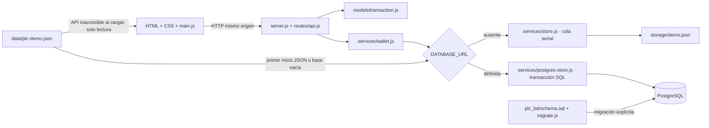

# Proletarian Coin — demo con API y persistencia JSON o PostgreSQL

PLC conserva el frontend HTML/CSS y añade una API de desarrollo para simular saldo, envíos, recepciones, historial, detalle y recargas. **No es una criptomoneda, una billetera custodial ni un servicio de pagos.** Todos los PLC son ficticios. No ingreses datos personales, datos bancarios reales, direcciones Ethereum reales ni frases semilla. **Estado confirmado al 28 de septiembre de 2026:** la rama `main` de `ddepazos/plc` está desplegada en Render como `plc-demo`, con backend Node.js y persistencia PostgreSQL en Neon. El acceso a la URL pública mediante HTTP Basic está confirmado. El proyecto `plc-demo` de Neon ya tiene las seis tablas de PLC y el servicio `plc-demo` de Render está publicado en [https://plc-demo.onrender.com](https://plc-demo.onrender.com) en el plan Free. El despliegue `b520071` registró la migración PostgreSQL y el mensaje «Your service is live»; aún falta comprobar las operaciones completas desde el navegador.

## Inicio rápido

**Demo conectada:** [abrir PLC en Render](https://plc-demo.onrender.com/pages/dashboard.html). Usa HTTP Basic con el usuario `demo` y la contraseña almacenada únicamente en la variable secreta `PLC_DEMO_PASSWORD` de Render. Saldo, envíos, recepciones, recargas e historial usan la API y PostgreSQL de Neon; todas las operaciones son ficticias.

**GitHub Pages:** publica la portada y una vista de ejemplo de solo lectura. Los enlaces a las pantallas de la billetera abren Render, donde se ejecuta el backend. La banda «Abrir demo conectada» permite entrar desde una pantalla antigua de Pages. No se guardan contraseñas en JavaScript ni se conecta el navegador directamente a Neon. El primer acceso a Render Free puede tardar mientras el servicio se reactiva.

Requisito: Node.js 22 o superior con npm. El modo JSON usa solo módulos incluidos en Node.js. PostgreSQL es opcional y usa la dependencia `pg` declarada en `package.json`. No hay proceso de compilación.

```sh
git clone https://github.com/ddepazos/plc.git
cd plc
npm start
```

Abre `http://127.0.0.1:3000` y selecciona **Entrar a la demo**. También puedes abrir `http://127.0.0.1:3000/pages/dashboard.html`. Para el modo JSON no hace falta instalar paquetes. Las fuentes de Google son opcionales; si no hay conexión, el navegador usa fuentes de respaldo. JavaScript no depende de jQuery.

```sh
npm install
npm test
```

La suite incluye pruebas del adaptador PostgreSQL, por eso requiere instalar `pg`; el uso normal del modo JSON sigue funcionando sin esa instalación. Las pruebas crean archivos temporales aislados y no modifican tu demo. Para detener el servidor, presiona Ctrl+C. En modo JSON, ejecuta **un solo proceso por archivo de persistencia**; la cola de escritura es por proceso, no distribuida.

### Configuración

| Variable | Predeterminado | Uso |
| --- | --- | --- |
| `PORT` | `3000` | Puerto HTTP; usa otro si está ocupado. |
| `HOST` | `127.0.0.1` | Usa `0.0.0.0` solo para un despliegue protegido; activa los requisitos de las tres variables siguientes. |
| `PUBLIC_ORIGIN` | Sin valor | Origen HTTPS público exacto, sin ruta. Si falta en Render, se usa `RENDER_EXTERNAL_URL`. |
| `PLC_DEMO_PASSWORD` | Sin valor | Contraseña de al menos 16 caracteres para el acceso Basic Auth con usuario `demo` en modo público. Nunca se guarda en Git. |
| `PLC_DATA_FILE` | `backend/storage/demo.json` | Archivo JSON de desarrollo; las rutas relativas se resuelven desde el directorio de ejecución. |
| `DATABASE_URL` | Sin valor | Si está definida, usa PostgreSQL en vez del archivo JSON. Es obligatoria con `HOST=0.0.0.0`; no hay conversión automática entre ambos modos. |

Por defecto el servidor escucha solo en `127.0.0.1`. Al usar `HOST=0.0.0.0`, exige origen HTTPS, contraseña de demo y PostgreSQL para evitar publicar un servidor abierto o un archivo efímero. Sigue siendo una **demo compartida**, sin autenticación de usuarios individuales. No se lee `.env` automáticamente; configura variables en el entorno antes de iniciar.

### Publicación en Render con Neon

El health check es [`GET /api/health`](https://plc-demo.onrender.com/api/health), sin Basic Auth. Quedan pendientes el Blueprint `plcdb` de Render, que muestra **Failed sync**, y una advertencia SSL del cliente PostgreSQL `pg`. Consulta el [estado e incidencias pendientes](docs/hosting-render-neon.md#incidencias-pendientes) para su seguimiento.

El manifiesto [`render.yaml`](render.yaml) configura el Web Service Free que entrega frontend y API desde el mismo origen, migra el esquema al arrancar y utiliza Neon como base PostgreSQL. `DATABASE_URL` y `PLC_DEMO_PASSWORD` son secretos del entorno de Render; GitHub no necesita credenciales de Neon. Consulta la [guía de Render y Neon](docs/hosting-render-neon.md) para comprobar saldo, operaciones e historial y gestionar el servicio. El despliegue automático desde GitHub **aún no está verificado ni configurado**: requiere conectar GitHub como proveedor de código en Render. La sincronización automática del Blueprint es un ajuste diferente y tampoco confirma por sí sola el despliegue de cada cambio de código.

PowerShell:

```powershell
$env:PORT = '3001'
$env:PLC_DATA_FILE = Join-Path (Get-Location) 'backend/storage/otra-demo.json'
npm start
```

macOS/Linux:

```sh
PORT=3001 PLC_DATA_FILE=backend/storage/otra-demo.json npm start
```

Para empezar otra simulación, detén el servidor y cambia `PLC_DATA_FILE` a una ruta nueva. Para reiniciar la habitual, conserva una copia y renombra `backend/storage/demo.json` con el servidor detenido; el siguiente inicio vuelve a usar el seed. Nunca edites el archivo mientras el servidor está activo.

### PostgreSQL opcional

Necesitas un servidor PostgreSQL de desarrollo y una base vacía a la que tengas permiso de crear tablas. Instala la dependencia y aplica el esquema **antes** de iniciar el servidor:

```sh
npm install
# Configura DATABASE_URL en tu entorno con la URL de tu base local de prueba.
npm run db:migrate
npm start
```

Ejemplo de forma de la variable, con marcadores que debes reemplazar localmente: `postgresql://<usuario>:<clave>@127.0.0.1:5432/<base_demo>`. En PowerShell: `$env:DATABASE_URL = 'postgresql://...'`; en macOS/Linux: `export DATABASE_URL='postgresql://...'`. No guardes la URL, contraseñas ni archivos `.env` en Git ni pegues credenciales en incidencias. El proyecto no carga `.env` automáticamente. Si omites `DATABASE_URL`, vuelve al modo JSON; `PLC_DATA_FILE` solo rige ese modo.

`npm run db:migrate` aplica `plc_bd/schema.sql` mediante `plc_bd/migrate.js`. Al iniciar con una base vacía, `postgres-store.js` inserta la cuenta y los movimientos ficticios desde `data/plc-demo.json`; si la base ya contiene usuarios, no repite el seed. Las lecturas se refrescan desde PostgreSQL y cada operación usa una transacción y bloqueo de billetera para comprobar saldo e idempotencia. El esquema incluye tablas preparatorias de sesiones y ajustes de seguridad, pero **no hay login, sesiones ni 2FA implementados**. Lee [PLC_BD](plc_bd/README.md) y su [diagrama ER](plc_bd/diagrama-er.md).

## Arquitectura


```mermaid
flowchart LR
  UI[HTML + CSS + main.js] -->|HTTP mismo origen| API[server.js + routes/api.js]
  API --> VALID[models/transaction.js]
  API --> WALLET[services/wallet.js]
  WALLET --> MODE{DATABASE_URL}
  MODE -->|ausente| STORE[services/store.js · cola serial]
  STORE --> DISK[storage/demo.json]
  MODE -->|definida| PG[services/postgres-store.js · transacción SQL]
  PG --> DB[(PostgreSQL)]
  SCHEMA[plc_bd/schema.sql + migrate.js] -->|migración explícita| DB
  SEED[data/plc-demo.json] -->|primer inicio JSON o base vacía| MODE
  SEED -->|API inaccesible al cargar: solo lectura| UI
```

El servidor también entrega los archivos públicos. No necesitas dos servidores ni CORS. `DATABASE_URL` elige PostgreSQL al arrancar; de lo contrario se usa el JSON local. El cliente consulta el estado al entrar en cada pantalla y al volver a enfocar la ventana, y lo refresca después de una operación. No hay WebSocket ni sincronización continua entre pestañas.

### Árbol y función de cada archivo

```text
plc/
├── .gitignore                  # excluye persistencia, secretos, logs y node_modules
├── package.json                # Node >=22; start, test, db:migrate; pg opcional en ejecución
├── render.yaml                 # Web Service Free en Render; secretos solicitados al crear el Blueprint
├── README.md                   # contrato y guía de ejecución del proyecto
├── index.html                  # portada, comunidad y FAQ de la demo
├── assets/
│   ├── css/styles.css          # identidad visual original, responsive, foco y estados
│   └── js/main.js              # API, render seguro, formularios, fallback y navegación
├── data/plc-demo.json           # seed ficticio original; no se modifica al operar
├── pages/
│   ├── login.html              # acceso explícito a demo; no pide credenciales
│   ├── dashboard.html          # saldo actual y tres movimientos recientes
│   ├── wallet.html             # dirección ficticia, copia y recepción simulada
│   ├── enviar.html             # destinatario demo, monto, nota y saldo máximo
│   ├── cargar.html             # recarga genérica bancaria o Ethereum ficticia
│   ├── historial.html          # movimientos y filtro de búsqueda local
│   ├── detalle.html            # detalle por id; estado claro si no existe
│   └── perfil.html             # perfil seed de solo lectura; seguridad no implementada
├── backend/
│   ├── config.js               # rutas, DATABASE_URL, origen público, acceso demo y límite de cuerpo
│   ├── server.js               # HTTP, Basic Auth público, cabeceras, origen, archivos y errores
│   ├── models/transaction.js   # ApiError, validación, centésimas y creación de transacción
│   ├── routes/api.js           # GET/POST, lectura limitada del cuerpo y rutas de API
│   ├── services/
│   │   ├── store.js            # seed, cola, copia de estado y guardado temporal + rename
│   │   ├── postgres-store.js   # pool, seed SQL, lectura y transacciones PostgreSQL
│   │   └── wallet.js           # saldo, idempotencia, operaciones y representación pública
│   ├── storage/
│   │   ├── .gitkeep            # conserva la carpeta vacía en Git
│   │   └── demo.json           # generado localmente e ignorado por Git
│   └── test/
│       ├── api.test.js         # pruebas integradas de API, persistencia JSON y enlaces
│       └── postgres.test.js    # pruebas del adaptador SQL con base simulada
├── plc_bd/
│   ├── README.md               # alcance del modelo relacional de desarrollo
│   ├── schema.sql              # tablas, restricciones e índices PostgreSQL
│   ├── migrate.js              # aplica el esquema con DATABASE_URL
│   └── diagrama-er.md          # relaciones editables en Mermaid
└── docs/
    ├── plc-arquitectura.drawio # diagrama editable único de frontend, API, seed y persistencia
    ├── arquitectura.md        # decisiones, modelo, consistencia y límites
    ├── interacciones.md       # contrato de cada interacción frontend/backend y Figma
    ├── verificacion.md        # evidencia de pruebas y lista de comprobación visual
    ├── cambios.md             # inventario histórico de la primera entrega
    ├── hosting-render-neon.md  # creación, secretos, despliegue y verificación de la demo
    └── aws-free-tier.md       # propuesta privada de prueba en AWS y control de coste
```

## Endpoints

Todas las respuestas de API son JSON. Las operaciones exitosas responden HTTP 200. Los errores tienen forma `{"error":"mensaje"}`. La API usa una única cuenta ficticia compartida por los navegadores que acceden a ese proceso.

| Método | Ruta | Entrada / respuesta |
| --- | --- | --- |
| GET | `/api/health` | `{status:"ok",mode:"demo"}` |
| GET | `/api/state` | `{meta, users:[user], transactions:[transaction]}`; snapshot para la UI |
| GET | `/api/wallet` | Usuario ficticio y saldo PLC |
| GET | `/api/transactions` | Lista completa, movimiento nuevo primero |
| GET | `/api/transactions/:id` | Una transacción; 404 si no existe |
| POST | `/api/send` | `{amount, recipient, note?}`; debita saldo |
| POST | `/api/receive` | `{amount}`; simula crédito recibido |
| POST | `/api/topups` | `{amount, method}`; `bank` o `ethereum`; acredita PLC ficticios |

Cada POST requiere `Content-Type: application/json` e `Idempotency-Key` de 16–100 caracteres alfanuméricos o guiones. El frontend genera una UUID. Una clave repetida con la misma operación devuelve la misma transacción con `replayed:true`; si cambia la operación, responde 409. Las claves confirmadas se conservan en el archivo sin expiración; esto debe rediseñarse antes de escalar.

Ejemplo con el servidor iniciado (PowerShell):

```powershell
$headers = @{ 'Idempotency-Key' = [guid]::NewGuid().ToString() }
Invoke-RestMethod -Uri 'http://127.0.0.1:3000/api/send' -Method Post `
  -ContentType 'application/json' -Headers $headers `
  -Body '{"amount":"25.10","recipient":"PLC-DEMO-DESTINO","note":"Ensayo"}'
```

Respuesta: `{transaction:{id,userId,type,amount,date,status,reference,recipient?,method?,note?,demo},replayed:false}`. La nota tiene máximo 140 caracteres. Solo se aceptan destinatarios ficticios `PLC-DEMO-` seguidos de 3–60 letras mayúsculas, dígitos o guiones; no se permite enviar a la misma dirección demo. El destinatario no representa otra cuenta mantenida por este servidor: el envío solo debita al usuario de demostración.

Montos positivos de 0,01 a 1.000.000 PLC, máximo dos decimales, sin notación científica. Saldo máximo: 10.000.000 PLC. Validación autoritativa en el backend, adicional a los límites del formulario. Cuerpo máximo: 8 KiB. Se rechazan campos desconocidos.

Errores: 400 validación/JSON/clave; 403 host u origen externo; 404 ruta/transacción/archivo; 405 método; 409 saldo, límite o clave reutilizada; 413 cuerpo excesivo; 415 tipo de contenido; 500 fallo interno o de guardado. Los fallos internos no revelan rutas ni trazas al navegador.

## Modelo de datos

- `user`: id, nombre/email ficticios, dirección `PLC-DEMO-*`, moneda, datos de seguridad ilustrativos y `balanceCents` interno. No hay contraseñas ni claves criptográficas.
- `transaction`: UUID para movimientos nuevos y seed en PostgreSQL (el seed JSON conserva sus ids descriptivos), userId, tipo `sent|received|topup`, `amountCents` entero, fecha ISO, estado `completed`, referencia demo y campos opcionales `recipient`, `method`, `note`; `demo:true`.
- JSON persistido: `{version:1,user,transactions,requests}`. `requests` relaciona clave de idempotencia con firma de operación e id de transacción. PostgreSQL guarda los datos equivalentes en `users`, `wallets`, `transactions` e `idempotency_requests`; el esquema también define `user_sessions` y `security_settings` para una evolución futura, sin usarlas para autenticación hoy.
- API/seed: usa `balance` y `amount` en PLC para compatibilidad con el frontend. El servicio convierte centésimas a PLC al responder.
- El saldo seed de **2.450 PLC** es un saldo inicial independiente: sus cuatro movimientos son ejemplos históricos, no un libro mayor completo que reconstruya ese saldo.

## Flujo frontend/backend

1. `main.js` consulta `/api/state`; muestra una banda permanente de demo.
2. Si falla la carga inicial de API, obtiene `data/plc-demo.json`, muestra **solo lectura** y deshabilita operaciones. No mezcla ni sincroniza saldos de localStorage; la antigua clave `plc-demo-state-v1` deja de usarse.
3. Enviar, recibir o recargar valida el formulario, bloquea doble clic y hace POST. No se acredita ni debita de manera optimista en el navegador.
4. El servidor valida y comprueba idempotencia/saldo. Con JSON, serializa cambios en una cola y publica el nuevo estado después de guardar un archivo temporal y renombrarlo. Con PostgreSQL, bloquea la billetera, guarda el cambio en una transacción SQL y responde tras `COMMIT`.
5. Envío abre el detalle por id; recepción/recarga vuelve a consultar el estado y ofrece enlace al detalle. No se hace fallback de una escritura a datos locales.
6. Un fallo de red al escribir conserva la clave en memoria para reintentar **en el mismo formulario, sin recargar y sin cambiar datos**. Si recargas o cambias de pestaña antes de resolver una respuesta incierta, revisa el historial antes de repetir: la clave pendiente no sobrevive a la recarga.
7. Historial filtra los movimientos ya descargados. Detalle usa su endpoint específico; nunca sustituye un id inexistente por otra transacción.

## Seguridad y alcance demo

- El modo local escucha solo en loopback. El modo público exige origen HTTPS, PostgreSQL y `PLC_DEMO_PASSWORD`; valida Host/Origin y bloquea `Sec-Fetch-Site: cross-site`, sin CORS abierto. Solo `GET /api/health` queda sin Basic Auth para el chequeo de Render.
- POST exige JSON y clave; límites de tamaño, montos y texto. Dinero ficticio calculado con enteros.
- Lista permitida de archivos estáticos: el servidor no publica `.git`, backend, persistencia o configuración.
- CSP, `nosniff`, `no-referrer`, `no-store` y protección contra marcos. Render de contenido dinámico con `textContent`, no HTML interpolado.
- En modo JSON, persistencia ignorada por Git, archivo temporal y cambio de nombre, sin garantizar durabilidad de base de datos ante cortes de energía. Un archivo ilegible bloquea el inicio: no se sustituye silenciosamente por seed. En PostgreSQL, el operador debe proteger URL, acceso, respaldos y transporte; la demo no configura esto por sí sola.
- La contraseña pública restringe el acceso a **una única cuenta demo compartida**. No hay registro/login PLC, autorización multiusuario, cifrado de base de datos administrado por la app, rate limiting ni auditoría inmutable. Publica solo para pruebas con personas de confianza; no introduzcas datos reales.
- Banco: solo etiqueta genérica y referencia `DEMO-BANCO-001`, sin proveedor ni cuenta utilizable.
- Ethereum: solo opción de simulación; no RPC, MetaMask, contrato, red, firma, hash real, conversión ETH/PLC ni gas.
- Perfil y seguridad son información de demo, no funciones reales de cuenta. QR ficticio anterior retirado para no aparentar una dirección operativa.

## Documentación y Figma

Consulta [arquitectura](docs/arquitectura.md), [interacciones](docs/interacciones.md), [verificación](docs/verificacion.md), [modelo relacional](plc_bd/README.md), [Render con Neon](docs/hosting-render-neon.md) y [prueba privada en AWS](docs/aws-free-tier.md). El [inventario de cambios](docs/cambios.md) describe la primera entrega. Abre [`docs/plc-arquitectura.drawio`](docs/plc-arquitectura.drawio) en diagrams.net: es el diagrama editable único y corresponde al frontend, la API y ambos modos de persistencia. El diagrama alternativo obsoleto se retiró para evitar duplicidades.

[Figma: Proletarian Coin — Demo e interacciones backend](https://www.figma.com/design/oO77Doeh7yNvOOfZCaPusV). Se creó el archivo en el equipo personal, pero **la carga de pantallas y anotaciones quedó bloqueada por el límite de llamadas de Figma Starter**. El archivo aún está vacío; la carpeta solicitada tampoco pudo crearse: la interfaz de Figma indica que crear más carpetas requiere el plan Profesional. `docs/interacciones.md` contiene el material preparado para completar esa entrega sin reinterpretar el backend.

## Próximos pasos

1. Completar pantallas y anotaciones en Figma cuando vuelva a estar disponible el conector.
2. Persistir claves pendientes en el cliente para recuperación entre recargas, y añadir paginación, límites de historial y control de tasa.
3. Endurecer la opción PostgreSQL actual con migraciones versionadas, pruebas de concurrencia, respaldos y libro mayor de doble entrada antes de soportar cuentas múltiples.
4. Diseñar autenticación real, autorización por cuenta, gestión segura de sesiones y pruebas de seguridad.
5. Separar una eventual integración bancaria/blockchain en adaptadores auditados con entornos sandbox. Definir cumplimiento aplicable y operación antes de considerar dinero real.
6. Verificar en HTTPS las operaciones ficticias de [la demo en Render](https://plc-demo.onrender.com) y su persistencia en Neon. Después, conectar GitHub como proveedor en Render y comprobar el despliegue automático de un cambio en `main`, distinguiéndolo de Blueprint Auto Sync; añadir CI, pruebas de navegador, monitoreo y respaldo. Esta demo no constituye una plataforma de producción.
