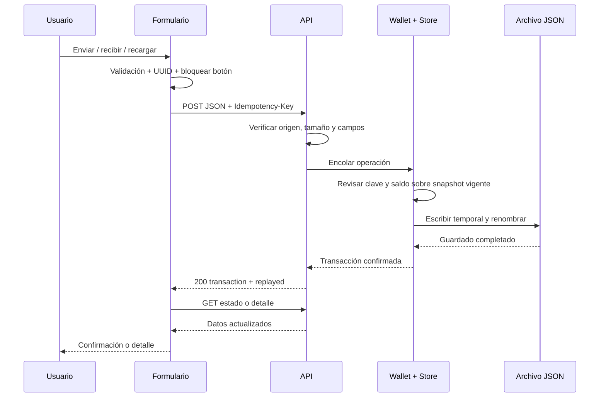

# Interacciones PLC — especificación para producto y Figma

## Estado de entrega Figma

Archivo creado: https://www.figma.com/design/oO77Doeh7yNvOOfZCaPusV

Equipo personal seleccionado por el usuario. El archivo está vacío: Figma devolvió límite de llamadas Starter durante el descubrimiento de bibliotecas. Tras recuperar el navegador, la interfaz del equipo indicó que crear más carpetas requiere el plan Profesional. La carpeta solicitada no se creó. No se cambió de plan, no se pagó y no se crearon pantallas de las que no exista evidencia.

## Inventario de pantallas

Portada → acceso demo → dashboard → wallet/recibir → enviar → recargar → historial → detalle → perfil. Mantener fondo #0b0b0c, panel #171719, rojo #e10600, texto #f7f7f7, bordes #303034, secundarios #a8a8ad, radio de tarjeta 18 px. Tipografías: Bebas Neue para títulos e Inter para cuerpo; respaldo Arial/sans-serif. En escritorio la navegación lateral ocupa 250 px; bajo 850 px pasa a fila desplazable y las tarjetas a una columna. Bajo 560 px las acciones se apilan. No añadir un formulario de credenciales real al diseño demo.

## Matriz de interacciones

| Pantalla / acción | Petición | Backend / persistencia | Resultado visible y error |
| --- | --- | --- | --- |
| Entrar a demo | Navega a dashboard; GET /api/state | Lee snapshot del store | Alex Demo, saldo e historial; sin registro ni login real |
| Cargar cualquier pantalla | GET /api/state | Snapshot coherente de user y transactions | Banda API conectada; fallo inicial → JSON seed, banda solo lectura y botones deshabilitados |
| Volver a enfocar pestaña | GET /api/state | Lee estado actual si no hay solicitud pendiente | Actualiza saldo y listas; error indica conexión interrumpida |
| Saldo máximo | Sin petición | Ninguno | Rellena monto con saldo visible, limitado al máximo por operación; backend revalida al enviar |
| Enviar PLC | POST /api/send {amount,recipient,note} + Idempotency-Key | Valida dirección, monto, saldo; debita e inserta movimiento en una sola actualización | Botón bloqueado mientras espera; éxito → detalle con id; 400 datos inválidos, 409 saldo insuficiente |
| Copiar dirección | Clipboard del navegador | Ninguno | Copiado o instrucción de selección manual; dirección inequívocamente ficticia |
| Recibir PLC | POST /api/receive {amount} + clave | Genera crédito ficticio, suma saldo e historial | Refresca estado, mensaje de éxito y enlace al detalle; nunca espera una transferencia externa |
| Elegir banco | Sin petición | Ninguno | Texto DEMO-BANCO-001, sin número bancario utilizable |
| Elegir Ethereum | Sin petición | Ninguno | Explica ausencia de wallet, ETH, red, gas y firma |
| Simular recarga | POST /api/topups {amount,method:bank/ethereum} + clave | Valida método; acredita PLC, persiste movimiento con método | Saldo actualizado y enlace al detalle; no conversión ni integración bancaria/blockchain |
| Historial | GET /api/state (GET /api/transactions disponible para consumidores) | Lista de movimientos, nuevos primero | Filtrado local por tipo, fecha, referencia, destinatario o método; vacío explícito |
| Abrir detalle | GET /api/transactions/:id | Busca id exacto | Monto, tipo, fecha, estado, referencia, destino, método, nota; 404 se muestra sin sustituir movimiento |
| Perfil | GET /api/state | Datos seed de solo lectura | Autenticación, 2FA y sesiones marcados como no implementados/demo |
| API no disponible al inicio | GET data/plc-demo.json | Ninguna escritura | Datos ficticios originales, operaciones deshabilitadas; iniciar API y recargar para operar |

## Secuencia de una operación

## Estados a representar en Figma

Cada formulario necesita reposo, envío en curso, éxito, validación rechazada, saldo insuficiente y conexión incierta. Incluir ejemplos de monto 0,001 (rechazado), envío mayor que saldo (409), misma clave con igual operación (replayed:true) y clave con otra operación (409). La nota y referencias se muestran como texto, nunca se interpretan como HTML.

En un corte después de guardar, la respuesta puede perderse: reintentar sin cambiar los datos en el mismo formulario reutiliza la clave. La clave pendiente solo vive en memoria; antes de recargar/navegar y volver a enviar hay que revisar el historial. No dibujar un éxito hasta recibir respuesta. Si la operación se confirmó pero falla el refresco del saldo, mostrar esa diferencia y bloquear nuevos envíos hasta recargar.

El diseño de Figma será una especificación/prototipo; no debe afirmar que ejecuta Node o procesa pagos dentro de Figma. Las flechas y notas explicarán el contrato implementado en el repositorio.
