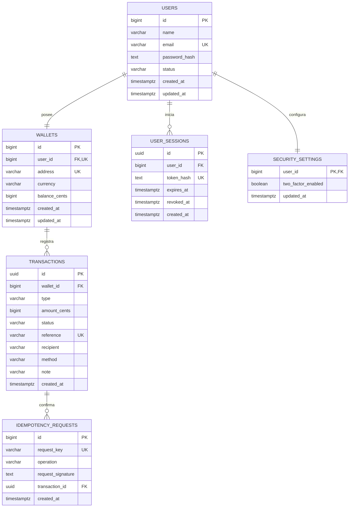

# Diagrama entidad-relación — Proletarian Coin

```mermaid
erDiagram
    USERS ||--|| WALLETS : posee
    USERS ||--o{ USER_SESSIONS : inicia
    USERS ||--|| SECURITY_SETTINGS : configura
    WALLETS ||--o{ TRANSACTIONS : registra
    TRANSACTIONS ||--o{ IDEMPOTENCY_REQUESTS : confirma

    USERS {
      bigint id PK
      varchar name
      varchar email UK
      text password_hash
      varchar status
      timestamptz created_at
      timestamptz updated_at
    }
    WALLETS {
      bigint id PK
      bigint user_id FK,UK
      varchar address UK
      varchar currency
      bigint balance_cents
      timestamptz created_at
      timestamptz updated_at
    }
    TRANSACTIONS {
      uuid id PK
      bigint wallet_id FK
      varchar type
      bigint amount_cents
      varchar status
      varchar reference UK
      varchar recipient
      varchar method
      varchar note
      timestamptz created_at
    }
    IDEMPOTENCY_REQUESTS {
      bigint id PK
      varchar request_key UK
      varchar operation
      text request_signature
      uuid transaction_id FK
      timestamptz created_at
    }
    USER_SESSIONS {
      uuid id PK
      bigint user_id FK
      text token_hash UK
      timestamptz expires_at
      timestamptz revoked_at
      timestamptz created_at
    }
    SECURITY_SETTINGS {
      bigint user_id PK,FK
      boolean two_factor_enabled
      timestamptz updated_at
    }
```

Este DER refleja la siguiente etapa del backend, no la persistencia JSON actualmente activa.
